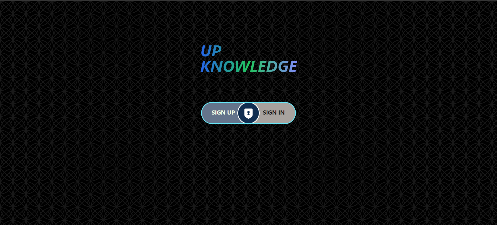
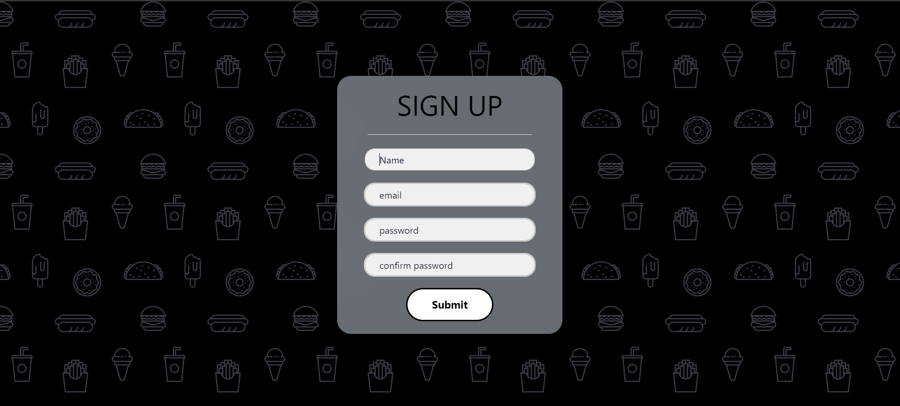
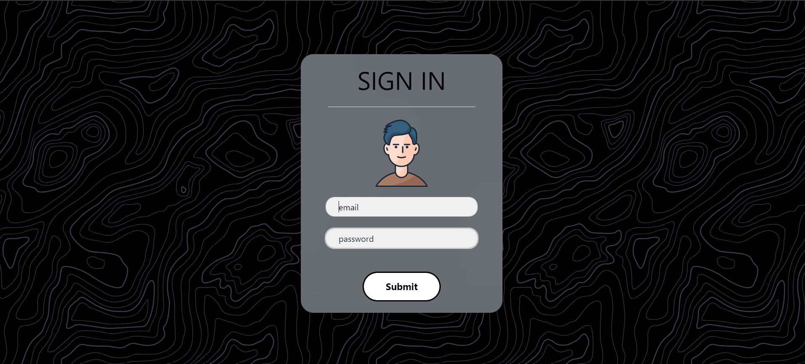
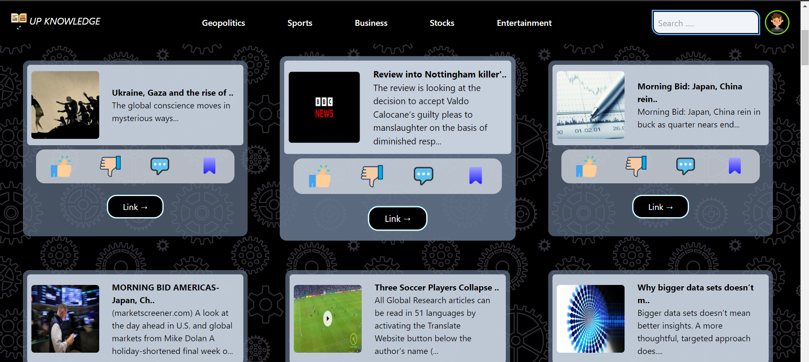

# up-knowledge

## Description
**up-knowledge** is a modern news website designed to provide users with timely and relevant news updates. It caters to a diverse audience interested in staying informed about current events across various categories.

## Features
- **Breaking news updates**
- **Categories for different topics** (e.g., geopolitics, sports, entertainment)
- **Search functionality**
- **User authentication and profiles**
- **Commenting and source link**

## Installation
1. Ensure you have Node.js and MongoDB installed on your system. If not, you can download and install them from the official websites:
   - [Node.js](https://nodejs.org/)
   - [MongoDB](https://www.mongodb.com/)

2. Clone the repository:

3. Navigate to the project directory:

4. Install dependencies: `npm install`

5. Set up environment variables (if required).

6. Start the development server:

## Usage
Once the development server is running, you can access the website by navigating to [http://localhost:3000](http://localhost:3000) in your web browser. From there, you can:
- **Browse news articles** by category or use the search functionality to find specific topics.
- **Create an account and log in** to access personalized features such as commenting and saving articles.
- **Engage with other users** through comments and discussions on articles.
- **Share articles** on social media platforms.
- **Stay updated with breaking news alerts**.

## Technologies Used
- HTML/CSS
- Tailwind
- JavaScript
- Node.js
- Express.js
- MongoDB
- JSON Web Tokens (JWT) for user authentication
- bcrypt.js for password hashing
- Mongoose ODM (Object Data Modeling) for MongoDB

## Author
sandhan meher

## Screenshots
### Authentication Page

The Authentication Page is where users can authenticate themselves, either by signing up for a new account or signing in with their existing credentials.

### Signup Page

The Signup Page allows new users to create an account by providing their details such as username, email, and password.

### Signin Page

The Signin Page is where existing users can log in to their accounts by entering their credentials.

### Home Page

The Home Page is the main interface of the website where users can access various features and content, such as news articles, categories, and user profile options.
